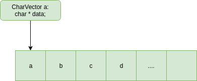
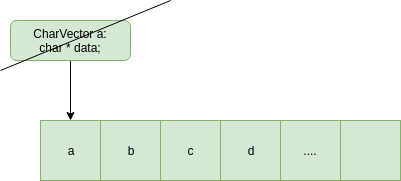
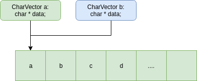
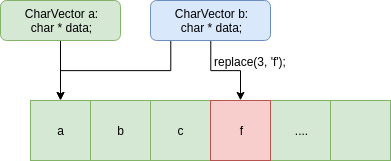
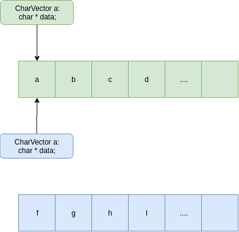
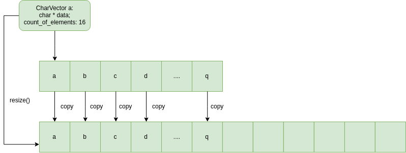
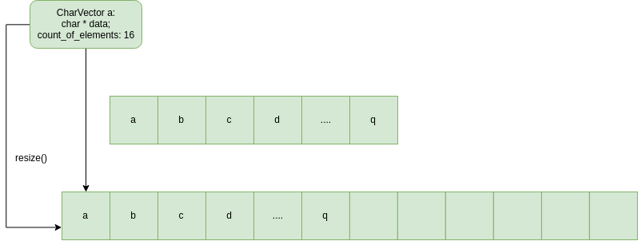
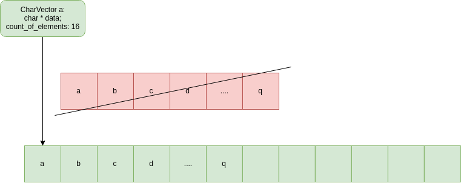
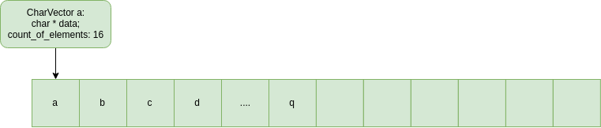

# Week 6
During lectures we saw that the dynamic memory allows us to make arrays of elements with a variable length that is not known during compile time (for example the user could enter the size of the array from the console).
The lack of dynamic memory forces us to set upper bounds on the input, but why? Computers nowadays have a **lot** of memory available, why shouldn't we be able to use as much as we need, no more, no less.

In the case of arrays, we always set an upper bound, for example 1000, which will always be allocated no matter how much of it we use. This is not good because of several reasons.

1. We do not always use the whole memory that is allocated.
2. In the cases we do need more, we would have to compile the program again with a bigger constant or run into a runtime error.

How much more convinient would it be if we didn't have to think about this?
And here's where the dynamic memory comes in handy.

## Exercise 1
We will implement a vector class (a dynamic array) of characters named `CharVector` which can hold a variable amount of characters.

Let's start with something simple, our class initially will work as a wrapper to a dynamically allocated array with a static size of 16 elements. Later on we will find out how easy it is to change it from a fixed size to a self-expanding array.

Our class will have the following functions, for now
```c++
class CharVector {
public:
  char at(int index) const;
  void push_back(char a);
  void replace(int index, char a);
  void insert(int index, char a);
  int count() const;
};
```
Where the function have the following behaviour:

| Function | Behaviour |
| ------  | -------- |
| at(int index) | Returns the element in the array at index **index** | 
| push_back(char a) | Adds the character in the variable a, in the last available position in the internal array of our vector |
|  replace(int index, char a) | On position **index** of the array it assigns the character in the variable a|
| insert(int index, char a) | On position **index** of the internal array it adds the value of the variable a, after moving each element after (and including) position index to the right |
| count() | Returns the number of elements currently in the array | 

Because our class uses dynamic memory,we will have to implmement our own special functions - the copy constructor, copy asignment operator and the destructor.

### The Destructor
If we assume that we have the destructor that is generated by default from C++, we will have the following scenario take place



Everything looks okay, but when we want to delete the object `a` (meaning the function `~CharVector()` is called) the following happens



Meaning we lose the pointer to the dynamically allocated array, and it remains allocated. We have to make sure that it is deleted before we destroy the pointer to it. For that reason we have to implement our own destructor.

### The Copy Constructor
What would happen in the following line (given the default impementation of the copy constructor)?

```c++
CharVector b(a);
```
or the equivalent call in this case, because the memory for **b** is being currently allocated.
```c++
CharVector b = a;
```
The pointer to the internal array of **b** will point to the same array as **a**



And if we change anything in either vector, the change will be present in both **a** and **b**, that is **not** a desired behaviour.



```c++
char c = a.at(3);
c == 'd' // returns false because b changed a
```

### The Copy Assignment Operator
For the copy assignment operator to be called, we have to have two objects that have memory allocated for them.

Meaning something of the lines of
```c++
CharVector a;
CharVector b;
```


If we execute this line
```c++
b = a;
```



In this case, what happens is awful, we lose the pointer that is allocated by the vector **b** and with each change made by the vector **a** it will be seen by **b** as well and the reverse is true too.

### Solutions to our problem
This means we have to solve our problems caused by the automatically generated functions by implementing them ourselves.

In the destructor, we will have to delete the dynamic memory.
In the copy constructor, we will have to copy the dynamic memory from the other object.
And in the copy assignment operator we will have to delete the dynamic memory which is allocated by our object, and allocate a new chunk of memory to copy the other object's data to ours.

### Why?
Okay, but why all this work? We would've had the same effect without dynamic memory.
The answer to this is - we aren't finished yet.

At this point we have an array with 16 elements and when we fill it up, we stop.
Can we find out when it fills up?
- The answer is - yes, we have. We can keep track of how many elements we have added and when it is full. When it is full we can just substitute the array for a bigger and move the elements from the old one to the new one. By doing this whenever we use this class, we won't have to think about it filling up and giving us an error.

#### Step 1
We allocate a new array, with a bigger size (for example - two times larger than our current one) and then copying the elements from the current one to the new one.



#### Step 2
We redirect the pointer to our current array to the new one.



#### Step 3 (Important)
We free the memory that is taken up from our old array.



Expected result after `resize()`



Now we have an array which, whenever it gets full, it becomes larger on its own.
Having all these methods we can be sure that we are dealing with the dynamic memory allocation correctly, and thus we can use it as a primitive type. It can now be copied and deleted without side effects.

## Exercise 2
Using the dynimc array from the previous exercise, we can modify [stack fromlast week](../05-stack/EN.md#exercise-1) so that it works with a variable amount of elements.

For simplicity we can add another function of the `CharVector`, `pop_back()` which simply decrements the internal element counter for the `pop()` function of the `CharStack` because we still haven't implemented a delete function of the vector.

## Exercise 3
Given an expression of the following format:
 
```
<expression> ::= <letter> | f(<letter>) | g(<letter>) | h(<letter>, <letter>) | l(<letter>, <digit>) | r(<letter>, <digit>)
<digit> ::= 1 | 2 | ... | 9
<letter> ::= a | b | ... | z | A | B | ... | Z
```
Where
```
f(x) = lower_case(x)
g(x) = upper_case(x)
h(x, y) = min(x, y)
l(x, y) = the letter that is with y positions before x, or 'a' if y > the position of x in the alphabet
r(x, y) = the letter which is with y positions after x or 'z' if y + the position of x in the alphabet is above the number of letter in the alphabet
```

Defune a function that calculates a valid expression of the format specified up above and to returns the calculated result.
