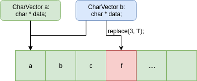
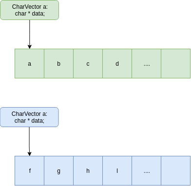

# Упражнение 6
На лекции видяхме, че динамичната памет ни позволява да правим масиви с размерност която не ни е позната по време на компилация (например потребителят да може да въвежда стойността от конзолата).
Липсата на динамична памет ни принуждаваше да даваме горни граници на на входа, но защо? Компютрите имат много памет, защо да не може да използваме толкова колкото ни трябва в момента на изпълнение на програмата.

В случаят на масивите, винаги даваме някаква горна граница, например 1000, която винаги се заделя без значение дали я използваме или не. Това е не е добро поради две причини.

1. Ние не използваме цялата през повечето изпълнения на програмата
2. В случаите които ни трябва повече, трябва да компилираме програмата отново с друга, по-голяма константа

Колко по-удобно би било ако няма нужда да мислим за това?
Тук идва на помощ динамичната памет.

## Задача 1
Ще реализираме клас вектор (динамичен масив) от символи `CharVector` 
Който държи произволен брой символи.

Нека започнем просто, класът ни първоначално ще работи само със динамичен масив с 16 елемента и по-късно ще определим какво трябва да направим така че да работи за произволен брой символи.

Класът ни ще има следните функции:
```c++
char at(int index) const;
void push_back(char a);
void replace(int index, char a);
void insert(int index, char a);
```

Тъй като класът ни ползва динамична памет, ще се наложи да имплементираме специалните член-функции - конструктор за присвояване, оператор за присвояване и деструктор.

### Деструктор
Ако предположим че имаме този който е генериран по подразбиране, ще имаме следният сценарий


Всичко изглежда добре, но когато се настъпи момента в който искаме да унищожим обекта `a` (тоест се извиква `~CharVector()`) става следното


Тоест губим указателят към динамичният масив и същевременно той остава заделен. Трябва да се погрижим за това той да бъде изтрит. За това трябва да предефинираме деструкторът.

### Конструктор за присвояване (Копи конструктор)
Какво ще се случи при следното извикване (със конструкторът за присвояване по подразбиране)?
```c++
CharVector b(a);
```
или еквивалентното извикване в този случай, защото паметта за **b** се заделя заделя в момента
```c++
CharVector b = a;
```
Указателят към масивът на **b** ще сочи към същият масив който ползва **a**


Ако променим кой да е от двата вектора, промяната ще е видима и за двата обекта **a** и **b**, това **не** е желано поведение.



```c++
char c = a.at(3);
c == 'd' // връща false защото b е променило a
```

### Оператор за присвояване
За операторът за присвояване да се изпълни, трябва да имаме два обекта вече заделени.
Тоест нещо от вида
```c++
CharVector a;
CharVector b;
```



Ако изпълним този ред
```c++
b = a;
```


Този случай е ужасен, губим достъп до масивът заделен от векторът **b** и всяка промяна на векторът **a** ще се отразява на **b** и обратното.

### Решения на проблемите
Значи за да оправим проблемите причинени от член-функциите които са генерирани по подразбиране трябва да ги напишем сами.

В деструкторът ще трябва да изтриваме динамичната памет.
В конструкторът за присвояване ще трябва да копираме динамичната памет от другият обект.
А в операторът за присвояване ще трябва да изтрием динамичната памет която сега сме заделили и да копораме динамичната памет от другият обект.

### Защо?
Добре, но защо цялата тази работа? Същият ефект бихме постигнали без динамична памет. 
Отговорът на това е че решението ни не е завършено.

На този етап имаме масив който има 16 елемента, и когато се запълни спираме.Има ли начин да разберем кога се запълва?
- Отговорът е - имаме. Можем да следим колко елементи сме добавили и когато го запълним да заменим масивът с друг, по-голям и да преместим елементите от текущият в новият. Така когато го ползваме няма да се притеснваме че ще го запълним.

#### Стъпка 1
Заделяме нов масив, с по-голям размер (например два пъти по-голям от текущият) и копираме всички елементи на нашият масив в новият.


#### Стъпка 2
Пренасочваме масивът който имаме като член данна към новосъздаденият.


#### Стъпка 4 (Важна)
Освобождаваме паметта заета от масивът който до сега сме ползвали.


Очакван резултат след `resize()`


Така имаме масив който веднъж когато се запълни, ще се оразмерява сам.
Като имаме всички тези методи и сме сигурни че се справяме с паметта както трябва, можем да го ползваме все едно е примитивен тип. Можем да го копираме и трием без да се притесняваме за странични ефекти от ползвателя.

## Задача 2
Използвайки динамичният масив от предната задача, да се модифицира стекът от предното упражнение (link) така че да работи за произволен брой елементи.

## Задача 3
Даден е израз от вида:
 
```
<израз> ::= <буква> | f(<буква>) | g(<буква>) | h(<буква>, <буква>) | l(<буква>, <цифра>) | r(<буква>, <цифра>)
<цифра> ::= 1 | 2 | ... | 9
<буква> ::= a | b | ... | z | A | B | ... | Z
```
Където
```
f(x) = lower_case(x)
g(x) = upper_case(x)
h(x, y) = min(x, y)
l(x, y) = буквата която е с y позиции преди x, или 'a' ако y > позицията на x в азбуката
r(x, y) = буквата която е с y позиции след x или 'z' ако y + позицията на x в азбуката надхвърля броят на буквите
```

Да се пресметне валиден израз от видът споменат по-горе и да се върне резултатът му.
