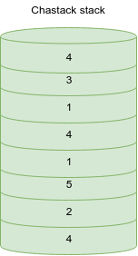
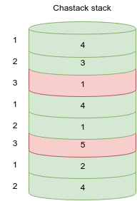
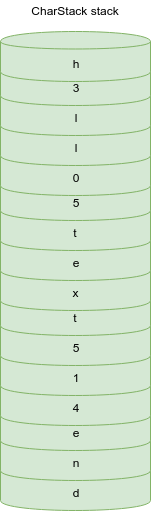
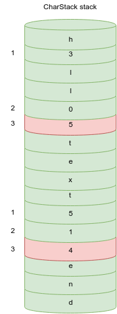
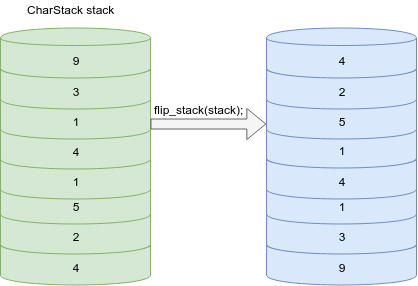

# Упражнение 7

Тази седмица отново ще разгледаме динамичната памет.
Много важно нещо е винаги когато имаме заделена динамична памет, след като свършим всичко което ни трябва заделената динамична памет да я изтрием.

## Задача 1
Да се реализира функция която при подаден стек от символи да намира сумата на всяка трета **цифра** от стека.

```c++
int sum_every_third_digit(CharStack stack);
```

### Примери

| Вход | Изход | Причина |
| :---: | :---: | :---: |
| | 6 |  |
| | 9 |  |

## Задача 2
Да се реализира функция която при при подаден стек стек му обръща елементите.

```c++
void flip_stack(CharStack& stack);
```

### Примери



## Задача 3
Да се дефинира функция която по подадени две целочислени матрици, връща нова матрица, представляваща резултатът от умножението на двете матрици.
```c++
int ** multiply_matrices(int ** left_matrix, int ** right_matrix, int rows, int columns);
```

### Вход
На първият ред ще бъдат подадени числата N и M, размери на матрица отговарящи съответно на брой редове и на брой колони на матрицата.
На следващите N на брой реда ще се въвеждат по M на брой числа които ще са съответно елементите на лявата матрица.
След това ще следват още M на брой реда с по N на брой числа за втората матрица.

### Изход
Да се принтира резултатът от умножението на матриците.

### Примери

|                               Вход                                    |                Изход              |
| --------------------------------------------------------------------- | --------------------------------- |
| 1 3 <br> 1 2 3 <br> 4 <br> 5 <br> 6                                   | 32                                |
| 3 3 <br> 5 6 1 <br> 2 1 4 <br> 2 2 1 <br> 5 1 2 <br> 1 2 0 <br> 2 1 4 | 33 18 14 <br> 19 8 20 <br> 14 7 8 |
| 2 3 <br> 5 2 1 <br> 1 2 4 <br> 4 3 <br> 5 9 <br> 5 6                  | 35 39 <br> 34 45                  |

## Задача 4
Да се дефинира функция която по подадено неотрицателно целочислено число N, връща низ, представляващ представянето на същото число в двоична бройна система, без да се заделя излишна памет. 
Ако например числото подадено е 5, неговото представяне в двоична броична система е 111 и низът който връща функцията трябва да е с дължина 4.

```c++
char * decimal_to_binary(int number);
```

### Вход
Входът е от едно единствено неотрицателно число N.

### Изход
Да се принтира върнатият низ съответстващ на двоичното представяне на числото N.

### Примери

| Вход | Изход  |
| ---- | ------ |
| 5    | 111    |
| 10   | 1010   |
| 32   | 10000  |
| 127  | 111111 |

