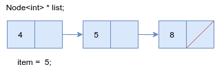
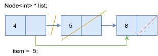
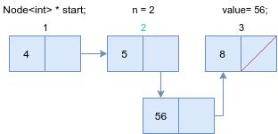
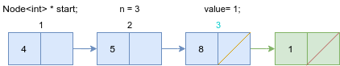

# Week 11

This week during lectures, we saw the different types of linked lists. We will take a look at them in a simplified way. We will work with the underlying structure that the list uses.
The idea of the linked list is that every element knows its "neighbours". In the Singly-Linked list every element knows the one that comes after him, and in the Doubly-Linked List - the one before and the one after it.

Elements are held in "boxes", each of which holds the value itslf, and a link (pointer) to the next one (if the list is doubly-linked then it also has the previous) box. The list will just be a sequence of boxes.

### Example
This is the box for a Singly-Linked List
```c++
template<typename T>
struct Node {
  Node<T> * next;
  T item;
};
```
If we have the following list, and a pointer to the first elements in the variable `start`


We can find each element of the list in the following fashion

```c++
  // Some code here...
  
  int first_element = start->item;
  int second_element = start->next->item;
  int third_element = start->next->next->item;
  Node<T> * end = start->next->next->next; // end == NULL

  // More code...
```
We can see, that to access each element we get the next element in a chain fashion using the `next` field. Everything is ok, but what if we don't know the count of the elements, how would we take it?
From this example we can also notice that when the next element points to the value `NULL` - this means that the list has ended. Using that knowledge we could do the following

```c++
  // Get start...
  current = start;
  while (current != NULL) {
    cout << current->item << ' ';
    current = current->next; // We know that current isn't null, otherwise the loop would've ended 
  }
```

> In the following exercises for us, the list will be a pointer to the first box

### Exercise 1
Using the structure `Node`, showed earlier, of a integer type, define a function that sums the elements of out "list", represented by a pointer to the first box.

### Exercise 2
Define a function that replaces the element on the `n`-th position in a list.

```c++
void replace(Node<T>* start, int n, T item);
```

#### Example


### Exercise 3
Define a function that removes the first element from the "list" beginning from `Node` which equals the element `item` and returns `true` in the case it removes an elements, and in the case it does not modify the list - `false`

```c++
bool remove_first_occurance(Node<T> *& start, T item);
```

### Example
We call the function with the following list and `item = 5`






#### Important! 

What would happen if you call the function with an element that is the same as the beginning?

### Exercise 4
Define a function that adds an element after the `n`-th element in the list.
If the list finishes before the position `n` - display a message on the console and stop the function execution.

```c++
void add_after(Node<T> *& start, int n, T value);
```

#### Example
Input data - the list and `n = 2`


It creates a new box and redirects the pointers in the following way


Finally the list looks as follows



Input data - the list and `n = 3`


It creates a new box anr redirects the pointer to the next element of the last element to the new one. The new element has a next element of `NULL`



Finally the lists looks as follows


### Exercise 5
Define a function, which prints a list in reverse order.

```c++
void print_reverse(Node<T>* start)
```

### Exercise 6
Define a function which flips the order of the elmements in a list.

```c++
void reverse(Node<T>*& start)
```

### Exercise 7
Define a function that sorts the elements of a list.
```c++
void sort(Node<T>*& start)
```

## Using the class List.

This sequence of nodes will be easily packed into a class - the Linked List itself. [Here is a sample implementation.](list-implementation/List.h)

### Exercise 8
Define a function that is a part of the List that deletes an element in the front of the List.

```c++
void deleteFront();
```

### Exercise 9
Define a function that is a part of the List that adds an element to the beginning of the List.
```c++
T getFront() const;
```

### Exercise 10
Implement a Queue using our improves version of a singly-linked list.

