# Упражнение 11

Тази седмица на лекции видяхме различните видове свързани списъци. Ние ще ги разглеждаме в опростен вид. Ще работим само върху структурата която списъкът използва.
Идеята на свързаният списък е че всеки елемент знае нещо за неговите "съседи". В едносвързъният списък всеки елемент знае за този който е след него, в двусвързаният - този преди и този след него.

### Например
Ако позваме структурата 
```c++
template<typename T>
struct Node {
  Node<T> * next;
  T item;
};
```

И имаме следният списък, и начален елемент указател към първият елемент в променлива `start`

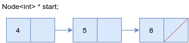

От тук можем да достъпим елементите по следният начин

```c++
  // Some code here...
  
  int first_element = start->item;
  int second_element = start->next->item;
  int third_element = start->next->next->item;
  Node<T> * end = start->next->next->next; // end == NULL

  // More code...
```

Тук виждаме, че може да достъпим всеки елемент като така верижно взимаме следващия ползвайки `next` полето. Всичко добре, обаче ако не знаем броят на елементите как бихме го взели?
От този пример се забелязва също така, че като следващият елемент сочи към стойността `NULL` - това значи, че списъкът е свършил. Ползвайки това, бихме могли да напишем следното

```c++
  // Get start...
  current = start;
  while (current != NULL) {
    cout << current->item << ' ';
    current = current->next; // Знаем че current не е NULL, в противен случай цикълът би приключил
  }
```

### Задача 1
Използвайки структурата `Node`, показана по-горе, от целочислен тип, да се напише функция която сумира елементите на нашият "списък"

### Задача 2
Да се напише функция която замества елемнтът на `n`-та позиция в списък.

```c++
void replace_in_list(Node<T>*& list, int n, T item);
```

#### Пример

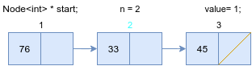

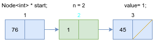


### Задача 3
Да се напише функция която изтрива първият елемент от "списъкът" започващ от `Node` който съвпада с `item` и връща истина в случая който премахва елемент, и ако не променя списъкът - лъжа

```c++
bool remove_first(Node<T> *& list, T item);
```


### Пример
Извикваме със следният списък и `item = 5`

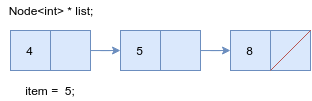

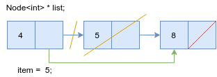

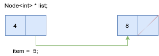

#### Важно! 

Какво би станало ако извикаме функцията с елемент съвпадащ с първият, началото.

### Задача 4
Да се напише функция която добавя елемент след `n`-тият елемент в списъкът.
Ако списъкът свърши преди позиция `n` да се изпише подходящо съобщение и прекрати изпълнението на функцията.

```c++
void add_after(Node<T> *& start, int n, T value);
```

#### Пример
Входни данни списъкът и `n = 2`

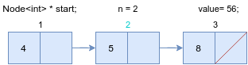

Създава нова кутия и пренасочва указателите по следният начин

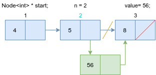

Окончателно списъкът изглежда така

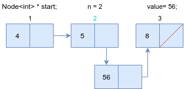

Входни данни списъкът и `n = 3`

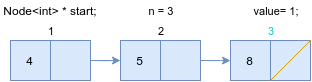

Създава нова кутия и пренсочва указателят към следващият елемент на последният елемент към новият. И новият има за следващ елемент `NULL` (тоест следващият елемент на елемента след който бива добавен)

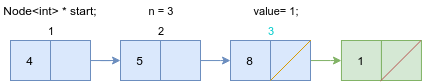

Окончателно списъкът изглежда така

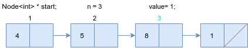


## Работа със класът свързън списък.

Сега може да копирате имплементацията на свързан списък с една връзка от лекции.

### Задача 5
Да се напише член-функция която трие елементът на начална позиция на свързан с една врзъка.

```c++
void deleteFront();
```

### Задача 6
Да се напише член-функция която достъпва елементът на последната позиция в свързан списък с една връзка.
```c++
T getEnd() const;
```

### Задача 7
Да се напише имплементация на опашка използвайки нашата подобрена версия на свързаният списък с една връзка.

