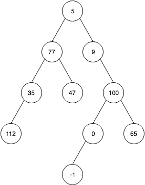

#### Домашно 4
# Нива

## Дефиниции
Дадено е двойчно дърво от цели числа. Всеки връх на дървото си има дълбочина. [Дефинираме](https://en.wikipedia.org/wiki/Tree_(graph_theory)#Rooted_tree) я като дължината (по брой ребра) на пътя от върха до корена.

Примерно за това дърво



Връх 5 е коренът и неговата дълбочина е 0.
Връх 77 е с дълбочина 1, връх 112 е с дълбочина 3, връх 0 е с дълбочина 3 и така нататък.

Опеределяме ниво като списък от всички върхове на дървото с еднаква дълбочина.

## Условие
Задачата ви е да имплементирате следната функция
```c++
List<List<int> > get_levels(TreeNode<int>* root);
```
която приема корен на дърво и връща списък от нивата на това дърво.

TreeNode е дефинирано така:
```c++
template <class T>
struct TreeNode {
    T data;
    TreeNode<T>* left;
    TreeNode<T>* right;
};
```

Може да използвате [тази имплементация на списък](../../13-lists/list-implementation/List.h) или някоя друга.

## Пример


За това дърво списъкът от нивата е:
`[[5], [77, 9], [35, 47, 100], [112, 0, 65], [-1]]`
