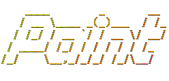

Нали знаете програмата __Paint__?
С нея можете да рисувате и творите различни изображения. Бихме искали да направим нещо подобно, но поради фактът че знаем да работим само с конзолни приложения, единственият начин да рисуваме по екранът е чрез символи.

Тъй като нямаме инструментите с които да казваме къде какво има (нямяме нито мишка нито графичен таблет нито тъчскрийн), ще представяме рисунката с поредица от двумерни координати и знаци съответсвтващи на тези координати.
Нашата задача ще е да имплементираме клас
```c++
class Drawing {
   Drawing(DynamicArray<Pixel>& pixels);
   Drawing(List<Pixel>& pixels); 
   void add_pixel(Pixel& pixel);

   void draw();
};
```
Който ползва структурата
```c++
struct Pixel {
  int x;
  int y;
  char element;
};
```

Обаче знаем че начинът по който принтираме в конзолата е по редове, като не можем да се връщаме назад. За това ще трябва преди да принтираме точките, да ги имаме в сортиран вид, първо по редове, после по колони (също така трябва да са уникални, но нека предположим че няма повтарящи се точки, тоест точки които имат едни и същи координати). Не е гарантирано че ще има точки на всяка координата, и като няма точка на дадена позиция предполагаме че има празно място (интервал).

Малко повече за функциите:
- `draw()` - рисува на конзолата множеството от точки които са в рисунката
- ``add_pixel(Pixel& pixel)` - добавя точка с координати и символ от `pixel` в множеството от точки на рисунката

### Неща които трябва да имаме предвид
- Броенето на редовете и колоните започва от 1, тоест (1, 1, 'c') - означава че на първият ред, първият знак е `c`.
- Когато принтираме един знак, не можем да го изтрием и напишем нещо ново.
- Когато принтираме знак на колона `i` ако искаме да принтираме знак на колона `j` има 3 случая
  1. `i = j` - е невъзможно (няма и да го разглеждаме защото предполагаме че са уникални)
  2. `i > j` - това значи че знакът е преди нашият, което не може да стане, не можем да се връщаме назад
  3. `i < j` - това значи че знакът е след нашият, което е възможно, но за да стигнем до позиция j трябва да добавим толкова на брой интервала, че курсорът да е на позиция готова за принтиране на позиция j
- Не можем да принтираме знак на предишен ред, само на следващите или същият

Или по друг начин казано, рисуването трябва да стане първо по редове (всички елементи от един ред да се принтират) след това елементите от другият ред и така нататък.
А редът на елементите на един и същ ред трябва да е от по-малко към по-голямо.

### Тестване и примери
За целта ще си направим `main` функция която на първият ред чете число `n` - брой на пикселите и на всеки от следващите `n` реда получава `<колона> <ред> <знак>`

След изпълнението изпълнява функцията `draw()` с тези елементи и рисува по конзолата.

Има няколко примера в папка [examples](./examples/) където файловете започащи с `input` са входът, а тези с `output` са изходът от програмта.

Ако искате сами да си правите примери и да видите как работи, съм написал кратка програма която можете да пуснете онлайн и да си генерирате примери.
Програмката [се намира тук](https://dotnetfiddle.net/Q6iF9u) и е написана на езикът C#, няма нужда да четете или разбирате кодът, просто това беше сравнително лесен начин за пускане на код онлайн за генериране на примери.
Горе натискате `Run` бутонът и долу въвеждате (или копирате текстът) който искате да нарисувате. След това пишете `END` за да сигнализирате край, и то извежда входът на нашата `main` функция която трябва да генерира текстът който сте подали.
