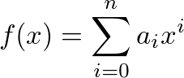
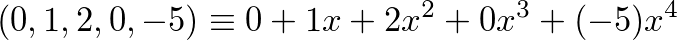
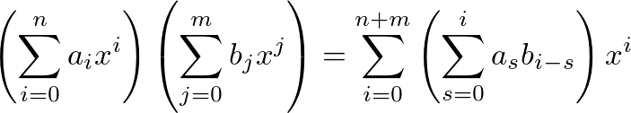
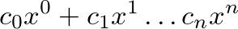
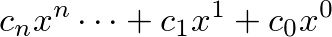
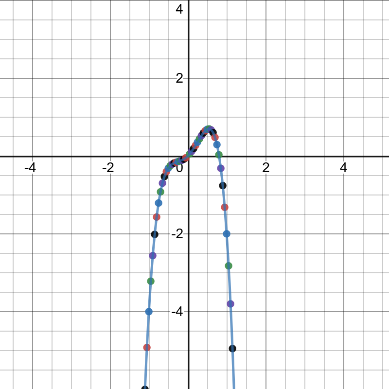

# Проект 3 - Полиноми



Тук ще искаме да моделираме полином с целочислени, рационални коефициенти или над какъвто и да е пръстен. Затова ще си направим шаблонен клас.
Нашият модел ще е сравнително прост. Ползвайки класът `DynamicArray`, който реализира автоматично-преоразмеряващ се динамичен масив, ще реализираме клас `Polynomial` който има следните функционалности

```c++
template <class T = int>
class Polynomial {
public:
  Polynomial();
  Polynomial(DynamicArray<Term<T>>& polynom);

  Polynomial<T> operator+(const Polynomial<T>& other) const;
  Polynomial<T> operator-(const Polynomial<T>& other) const;

  Polynomial<T> operator*(const Polynomial<T>& other) const;

  Point calculate_point(int x);
  DynamicArray<Point> generate_points(T x_start, T x_end, T distance);

  void print_polynomial();
private:
  DynamicArray<Term<T>> polynom;
};
```
където `Term` представлява следната структура

```c++
template<class T = int>
struct Term {
  T coefficient;
};
```
и `Point` е просто структура от x и y координати
```c++
template<class T = int>
struct Point {
  T x;
  T y;
};
```

За простота нашият полином ще е преставен само от коефициентите пред неговите членове, например:



Така нещата съответсващи на i-тата позиция в нашият динамичен масив от коефициенти е коефициента пред x на степен i.

### Как действат функциите
- `calculate_point(int x)` - пресмята резултатът на полиномът `f` в точката x
- `generate_points(int x_start, int x_end, T difference)` - пресмята точките `x_start`, `x_start + difference`, `x_start + 2*difference`  и така докато тази стойност не надвиши `x_end` като ги записва в динамичен масив от точки който е резултатът от изпълнение на функцията.
- `operator+` - събира два полинома, по типичния начин за събиране на полиноми, почленно
- `operator-` - изважда два полинома, по типичния начин за изваждане на полиноми, почленно
- `operator*` - умножава два полинома, по следния стандартен начин:

- `print_polynomial()` - принтира на конзолата полинома във вид 




или



Където коефициентите са `c0 ... cn` като пропускането или писането на нулевите коефициенти е по ваш избор.
Единственото важно е да се спира до максималната степен на полиномът, тоест максималната степен на полинома с ненулев коефициент е последният (или първият, зависи от версията) изписан.

### За тестване
Може да ползвате [Graphing Calculator на Desmos](https://www.desmos.com/calculator)
Като използвате следните две функции да принтирате резултатът от `generate_points(T x_start, T x_end, T difference)` по следният начин
```c++
template <class T>
void print_point(Point<T>& p) {
  cout << '(' << p.x << ',' << ' ' << p.y << ')' << '\n';
}
```
А за множеството точки в интервал (предполага се че са сортирани, тъй като интервалът се обхожда в нарастващ ред)
```c++  
template <class T>
void print_points(DynamicArray<Point<T>>& points) {
  for (int i = 0; i < points.getSize(); ++i) {
    print_point(points[i]);
  }
}
```

И след което може директно да се копира резултатът на един път и сложи в калкулаторът. Може и да си напишете самият полином (калкулаторът го поддържа) и да видите дали наистина работи. Също така ако ползвате `print_polynomial()` на полиномът и копирате изходът в калкулаторът, би трябвало множеството от точки да го апроксимират.  

Освен калкулаторът ще има няколко файла които са резултати от изпълнение на програмата с които може да разберете дали решението ви изглежда вярно.

Например, полиномът по-горе апроксимиран в интервалът (-10, 10, 0.05), тоест `x_start` е -10, `x_end` е 10 а разликата е 0.05 изглежда така



Където светло-синята линия е самата функция, а точките са нещата генерирани от `generate_points(-10, 10, 0.005);`
Изходът от този пример е [тук](./tests/example-1.txt)

Другите примери можете да разгледате [тук](./tests/)
